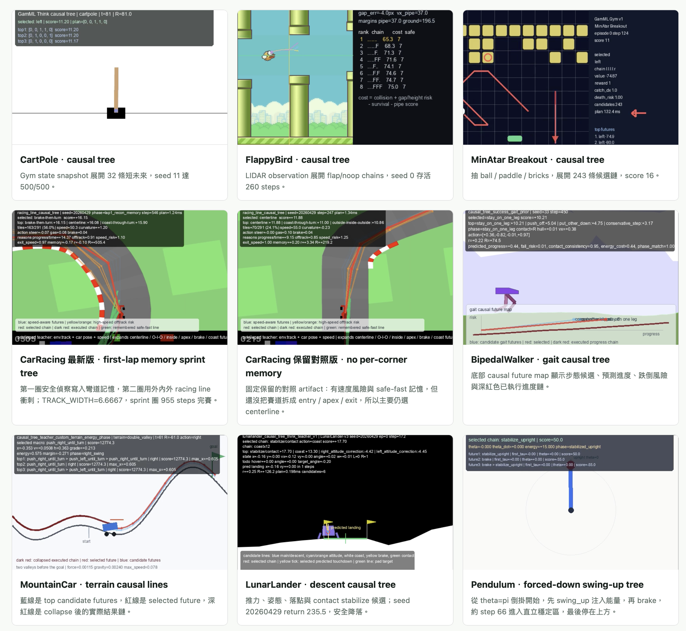
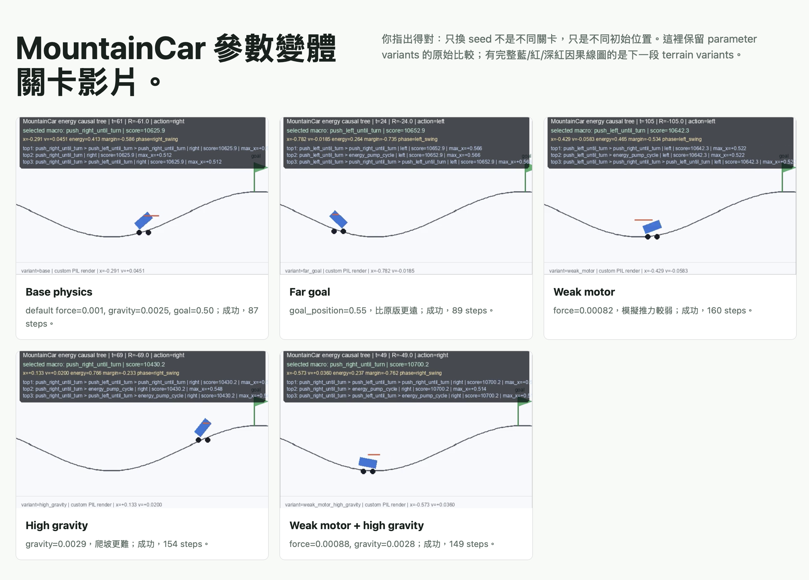
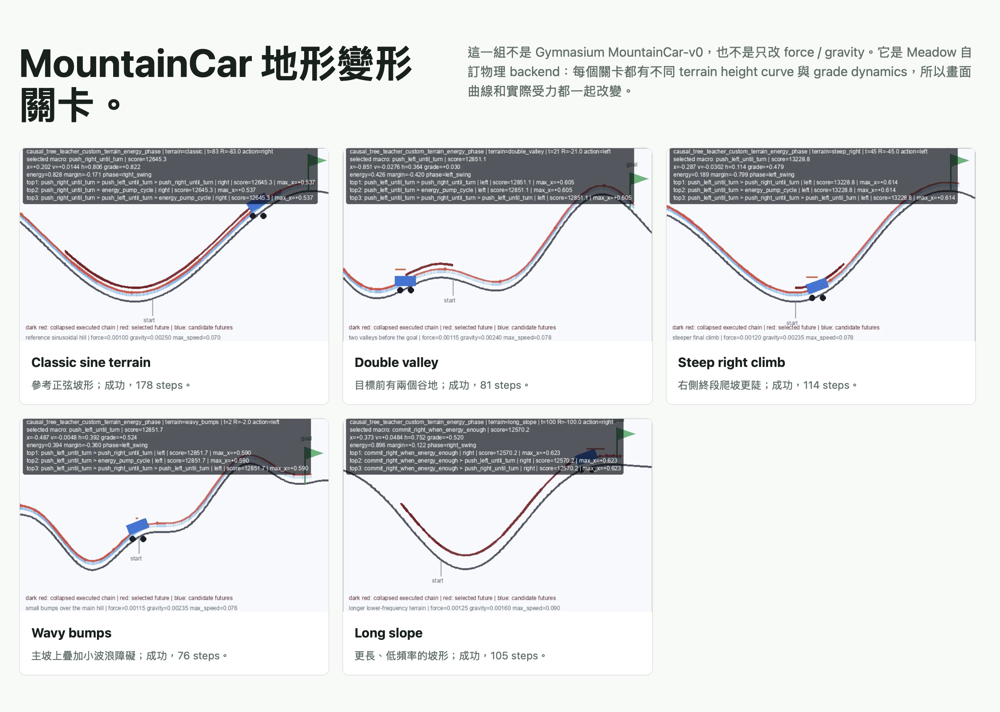
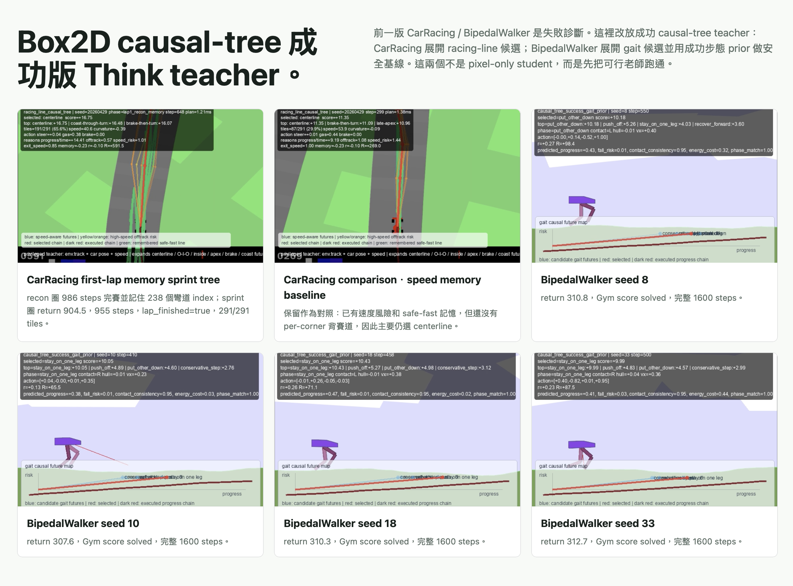

# Meadow WM for Games

[Live site](https://meadow-wm-for-games.pages.dev) · [GitHub repository](https://github.com/Hey-Meadow/Meadow-WM-for-Games)

Meadow WM for Games is a static research artifact viewer for the Meadow / GamML OpenAI Gym branch. It shows how the same Meadow loop, `GameSpec -> GoalSpec -> Think causal tree -> evidence artifacts -> Reaction distillation`, can be applied to game-control environments such as CartPole, MountainCar, LunarLander, Pendulum, Acrobot, MiniGrid, BipedalWalker, CarRacing, and Pong.

This repository is intentionally evidence-first. The site does not claim complete OpenAI Gym coverage. It preserves the current v1 causal-tree results, the videos, JSON summaries, plan traces, and selected framework scripts so each claim on the page can be checked against an artifact.

## Visual Walkthrough

### Causal-tree gallery



The gallery shows the public artifact viewer rather than a benchmark leaderboard. Each card connects a task to a visible causal-tree trace: short-horizon state rollout for CartPole, LIDAR-style branch ranking for FlappyBird, object extraction for MinAtar Breakout, racing-line candidates for CarRacing, gait futures for BipedalWalker, terrain causal lines for MountainCar, descent branches for LunarLander, and torque stabilization for Pendulum.

### MountainCar parameter variants



This section separates seed changes from real parameter changes. The parameter variants keep the same task family but alter the physical setup, including goal position, motor force, and gravity. The purpose is to test whether the energy-phase causal tree can preserve the correct strategy when the vehicle dynamics shift.

### MountainCar terrain variants



These are not vanilla `MountainCar-v0` runs with only `force` or `gravity` changed. They use a Meadow custom physics backend where each level has a different terrain height curve and grade dynamics, so both the rendered curve and the actual forces change. The blue, red, and dark-red lines make candidate futures, selected futures, and collapsed executed chains visible.

### Box2D causal-tree teacher



The Box2D section documents the move from failure diagnosis to successful teacher artifacts. CarRacing uses racing-line candidates and first-lap memory, while BipedalWalker uses gait candidates plus a successful gait prior for safety. These are explicitly reported as causal-tree teacher artifacts with environment or privileged state, not pixel-only student policies.

## Current Snapshot

- `11` Gym or game-like tasks are shown on the site.
- `57` JSON artifacts, `68` MP4 videos, `15` GIFs, and `8` Python framework files are included under `public/gamml_gym_v1/`.
- LunarLander is reported as two successful landing demos, not a 100-episode benchmark.
- Atari Pong is reported as a pixel causal-tree smoke test, not solved.
- BipedalWalker and CarRacing use environment state / privileged state in the current teacher artifacts; they are not pixel-only student policies.

## Repository Layout

```text
public/
  index.html                 # Cloudflare Pages entrypoint
  scene_soft_tall_gym.mp4     # hero video
  gamml_gym_v1/               # JSON summaries, plan traces, teacher scripts, videos
docs/
  framework.md                # Meadow WM for Games architecture
  evidence-map.md             # artifact inventory and task-level claims
wrangler.jsonc                # Cloudflare Pages config
package.json                  # local preview and deploy commands
```

## Local Preview

```bash
python3 -m http.server 8123 --directory public
```

Open:

```text
http://127.0.0.1:8123/
```

## Cloudflare Pages

This is a static Pages project. The build output directory is `public`.

Direct upload:

```bash
npx wrangler whoami
npx wrangler pages deploy public --project-name meadow-wm-for-games
```

Git deployment target after review:

```text
Hey-Meadow/Meadow-WM-for-Games
```

## Status

Pre-publication draft. Review the wording and artifact scope before the first GitHub push.
